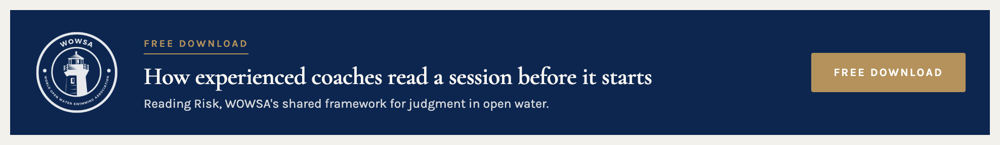
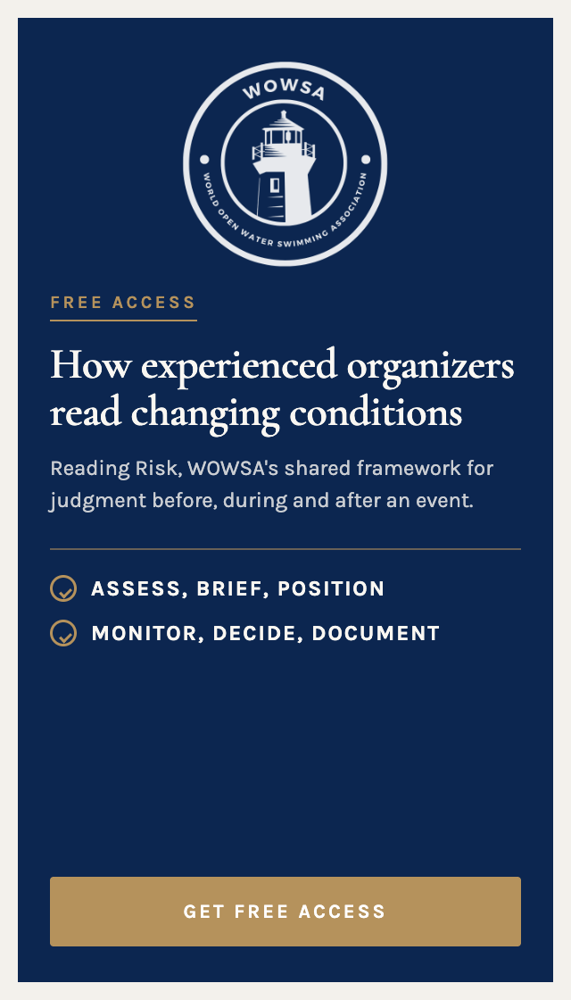
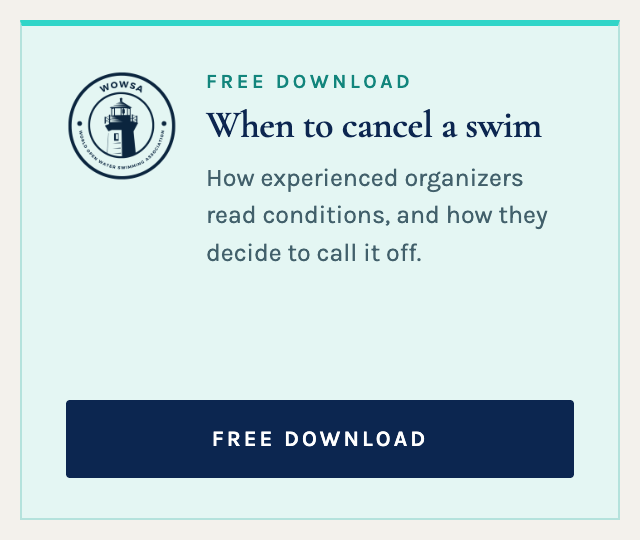

# WOWSA Archive Promotion Units

Six ready-to-paste HTML files for the WordPress article archive ad positions, sidebar, scraper and footer. Each file is self-contained: inline `<style>` scoped to a unique wrapper class, no build step, no external CSS or JS. Paste the whole file's contents into the existing Custom HTML widget for that position.

Approved design (navy `#0C2650`, ivory `#FAF7F2`, gold `#B5925C`, Cormorant Garamond over Karla), confirmed live and unchanged as of 3 September 2026. Full mockup and design rationale: https://claude.ai/code/artifact/7699c4ed-9536-41c5-b73e-a321fc775f8b

## Current strategy: capture, not sale

As of 3 September 2026, every unit leads to email capture. None link to a paid checkout. Quinn, 10:44am: *"Priority is email collection."* 11:12am: *"the goal is to not sell from ads on our site, it's to get emails and segment."* Coaches and organizers get sold to afterward, by correspondence, once they're identified through the signup.

Do not add a price, a checkout link, or a certification claim to any of these units without checking that this strategy is still current.

## The six files

| File | Slot | Size | Where | Destination |
|---|---|---|---|---|
| `slot-a-top-scraper.html` | A | 970 x 120 | Before the article title | `/learn/reading-risk`, coach framing |
| `slot-b-sidebar-banner.html` | B | 300 x 600 | Sidebar, top | `/learn/reading-risk`, organizer framing |
| `slot-c-sidebar-square.html` | C | 300 x 250 | Sidebar, below banner | `/learn/reading-risk` |
| `slot-d-mid-scraper.html` | D | 970 x 120 | Mid-article, roughly halfway through the content | `/learn/courses/marathon-swimming` |
| `slot-e-sidebar-square-alt.html` | E | 300 x 250 | Sidebar, in place of C | `/learn/reading-risk` |
| `slot-f-bottom-scraper.html` | F | 970 x 120 | After the article body | `/learn/reading-risk` |

A, D and F split the archive audience by how far they read. A shows before anyone starts, coach-framed, navy treatment, and carries the WOWSA mark. D and F share the same cream, no-mark treatment by design, one wide scraper style used twice: D sits mid-article with the Marathon Swimming course, F runs after the article body with the general-audience Reading Risk offer.

**CTA copy, by what actually happens when you click:** A and F both lead to Reading Risk, where readers get an immediate downloadable asset first, the email series that follows starts after that. "Free download" (A) describes that first-touch deliverable accurately, it is not describing the whole series. "Get free access" (F) is the same offer worded differently, so the two units don't show an identical button when they land on the same page together. D leads to the Marathon Swimming course, which requires signing in and enrolling, not downloading anything, so it says "Enroll for free" instead, matching what the destination page actually asks the reader to do.

### Preview

Rendered from the actual files, not mockups, so what you see below is what pasting the file produces.

**Slot A**


**Slot B**


**Slot C**


**Slot D**


**Slot E**


**Slot F**


**A, D and F run together automatically, plus one sidebar unit.** They sit at three different points in the same article (before, middle, after) via WPCode, so all three can appear on one page at once, that is by design, not an oversight. Add one sidebar unit (B, C, or E) on top of that. C and E are two visual treatments of the same offer, light and dark, use one or the other in a given sidebar, not both.

All destination URLs were checked live on 3 September 2026 and returned 200.

## How to install each file

Only the sidebar has a real widget area. There is no widget area in the header or the footer, and no separate "advertising block" anywhere on the site outside the sidebar, that description did not come from anyone who actually built this site.

**B, C, E, paste into the sidebar.** Content Aware Sidebars is active and already runs Custom HTML widgets there. Paste the file's contents straight into a Custom HTML widget in the relevant sidebar.

**A, D, F need a code snippet, not a widget.** These positions, before the article title, mid-article, and after the article body, have no widget area to paste into. **WPCode Lite is already active on the site**, confirmed 3 September 2026. Use it rather than editing a theme template:

1. In wp-admin, go to **Code Snippets → Add New** (WPCode).
2. Set the snippet type to **HTML Snippet**.
3. Paste the full contents of the file.
4. Set **Insertion → Location → Auto Insert**:
   - `slot-a-top-scraper.html` → **Insert Before Post**
   - `slot-d-mid-scraper.html` → **Insert Into Post Content**, positioned roughly halfway through (WPCode offers this as an after-paragraph-number or percentage-through-content option, pick whichever lands closest to the midpoint)
   - `slot-f-bottom-scraper.html` → **Insert After Post**
5. Under **Smart Conditional Logic**, restrict all three (A, D, and F) to **Posts, Pages, and Coaches** only, and explicitly exclude the homepage. None of these three should ever show on the homepage, only on individual posts, pages, and coach profiles. For A and F specifically, this also solves a second problem: without a Single Post restriction, "Before Post" and "After Post" can fire once per item on category and archive listing pages, repeating the unit down the page instead of showing it once on the article.
6. Save as inactive first, preview on one live post, page, and coach profile, then activate.

This uses WPCode's own insertion logic rather than a hand-written theme hook, so there is no guessing at which template file or action name this specific theme uses.

## Rollout order

1. **Global sidebar first.** Pick one sidebar unit (B, C, or E) and add it to the site-wide sidebar template. This alone reaches the 9,354 general-editorial pages that carry roughly two thirds of the archive's clicks.
2. **Conditional by category next.** Coach-tagged and profile pages get the coach-framed unit (A or B's coach copy), event and race pages get the organizer framing, safety and conditions pages get slot C or E.
3. **In-content snippets last.** Add A, F, and D as WPCode snippets on the highest-traffic 100 pages, which carry about half of all archive clicks. Highest effort, highest return, do it last.

## Why HTML and CSS, not images

These are live markup, not exported banners. Copy, the destination link, or the price framing can change without new artwork. Each file's CSS is scoped under a unique wrapper class (`.wowsa-promo-a`, `.wowsa-promo-b`, etc.) specifically so it cannot collide with the Wilcity theme's own styles when pasted into a live widget. Do not remove the wrapper class or the scoping, and do not rename the classes to something shorter or more generic.

## The mark

Slots A, B and C carry the WOWSA association mark, applied as a CSS mask so it can be tinted to whatever color the unit needs, white on the navy units, navy on the cream one, from a single source image:

```
https://www.openwaterswimming.com/wp-content/uploads/2023/07/wowsa-white-logo.png
```

This file is already live in the WordPress media library, confirmed byte-identical to the asset used in the approved mockup. No certification seal appears anywhere in this set, because none of these units are selling a certification right now. Slots D, E and F carry no mark at all: D and F share a plainer, mark-free cream treatment by design, E repeats slot C's offer in a different color treatment.

## Fonts

Georgia and system sans-serif fallbacks are declared but the primary faces are Cormorant Garamond (display) and Karla (body), matching the Learn design system. These are not loaded via `@font-face` in these files, since a WordPress Custom HTML widget should not be adding font requests. If the fonts are not already loaded site-wide, headlines will fall back to Georgia and body text to the system sans stack, which is an acceptable degradation, not a bug to fix here.

## Build notes, from the site audit

- The sidebar already runs `theia-sticky-sidebar`, so slot B and any sidebar unit follow the reader down the article at no extra cost, this is the theme's existing behavior and these files don't need to do anything to get it.
- The sidebar column is `col-md-4`, roughly 300 to 330px usable, so the 300px-wide units fit without scaling.
- Custom HTML widgets are already in use in this sidebar, confirmed by inspecting a live article, so these files drop into an existing widget slot rather than needing a new one.

## If something needs to change

Confirm against the current Notion implementation dashboard before changing colors, fonts, destinations, or the sell-vs-capture strategy: https://app.notion.com/p/3c890374ad9181ad9b18f7b4868774db. That page is the standing source of truth and is dated whenever something changes; a stale copy of this README is not.

American English throughout. No em dashes or en dashes anywhere in the copy.
